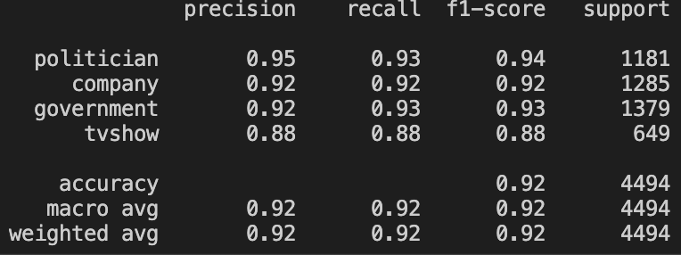
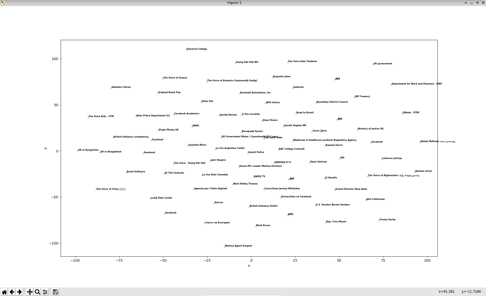
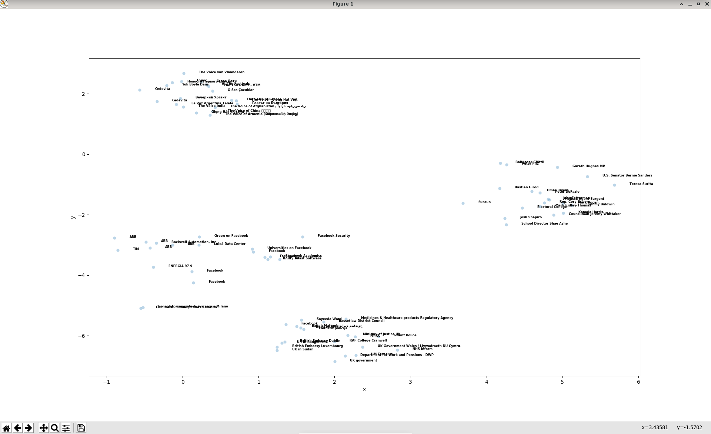

# DeepWalk

## Introduction

We implemented the DeepWalk algorithm, which learns social representations (embeddings) of graph vertices by modeling random walks. These embeddings capture neighborhood similarities and community structure, enabling downstream tasks such as node classification, link prediction, and community detection.

## Usage

> **Note:** All global variables and hyperparameters are defined in [`config.py`](./config.py).

### Setup and activate virtual environment

```bash
python3.12 -m venv venv
source ./venv/bin/activate
```

### Install required dependencies

```bash
(venv) python3.12 -m pip install -r requirements.txt
```

### Run DeepWalk pipeline

```bash
python deepwalk.py
```

### Visualize embeddings (optional)

```bash
python visualize.py
```

### Enable Gensim Word2Vec (recommended for speed)

Set the `USE_GENSIM` variable to `True` in [`config.py`](./config.py) (default).

Set `USE_GENSIM` to `False` to use the our Word2Vec implementation.

## Evaluation

### Node Classification & Visualization

- After obtaining node embeddings, we performed multi-class node classification using an MLP classifier (single hidden layer) to classify nodes into four categories. With an 80/20 train/test split, we achieved a weighted average classification accuracy of 92%.
- 

- We visualized embeddings using t-SNE to reduce dimensionality. Compared to the initial randomized embeddings, the trained embeddings form four clear clusters, each representing a category. This demonstrates DeepWalk's ability to encode graph structure for analytics.

- Initial randomized embeddings before training:
- 

- Final embeddings after training:
- 

## Project Structure

- `deepwalk.py`: Main pipeline script
- `config.py`: Configuration and hyperparameters
- `preprocess.py`: Data loading and graph construction
- `random_walk.py`: Random walk sampling
- `word2vec.py`: Embedding generation
- `classification.py`: Node classification
- `util.py`: Utility functions
- `visualize.py`: Embedding visualization (optional)
- `data/`: Raw and processed data files
- `models/`: Saved models
- `embeddings/`: Saved embeddings
- `results/`: Output results and reports

## Contribution

- Random Walk algorithm: Hangyu Du
- Word2Vec: Yiwen Chen & Hangyu Du
